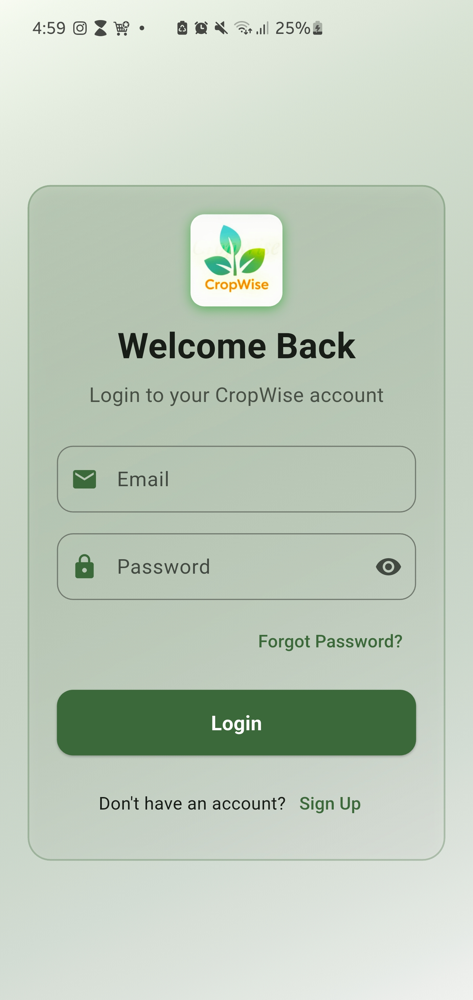
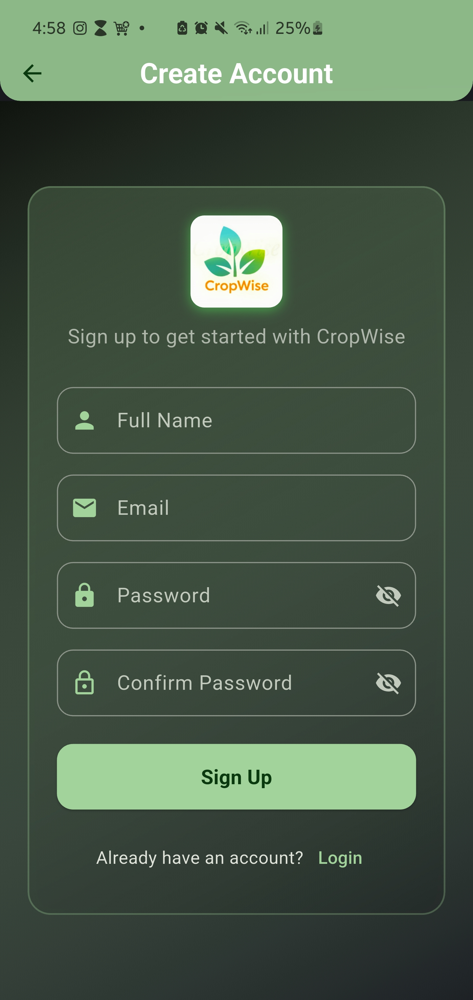

# CropWise

[](https://flutter.dev)
[](LICENSE)

CropWise is an AI-powered agriculture assistant designed to help farmers optimize crop health and productivity. The app fetches real-time weather data, uses artificial intelligence to provide actionable recommendations, and generates personalized schedules for farmers. CropWise also enables farmers to manage reminders and farming plans with a calendar view.

## Features

- **AI Smart Recommendations:** Get weather-based, hourly-updated, AI-driven advice for your crops, tailored to your location and primary crops. Recommendations are cached per hour for efficiency.
- **Chat with AI:** Ask farming, agriculture, or weather-related questions and get expert answers from the in-app AI assistant.
- **Smart Scheduling:** Receive and manage a tailored schedule of farming tasks based on your crops and local conditions.
- **Weather Integration:** Access up-to-date weather forecasts and receive weather-based farming advisories.
- **Reminder Calendar:** Set and view farming reminders and plans in a calendar interface.
- **Profile Management:** Edit your profile, set your primary crops, and customize your farming preferences.

## Screenshots

 
 
 
 
 
 
 
 


 
 
 
 
 
 
 
 


## Getting Started

### Prerequisites

- [Flutter SDK](https://flutter.dev/docs/get-started/install) (3.7.2 or higher recommended)
- Dart 3.7.2 or higher

### Installation

1. **Clone the repository:**
   ```bash
   git clone https://github.com/yourusername/crop_wise.git
   cd crop_wise
   ```

2. **Install dependencies:**
   ```bash
   flutter pub get
   ```

3. **Set up secrets:**
   - Add your Firebase configuration files:
     - `android/app/google-services.json`
     - `ios/Runner/GoogleService-Info.plist`
   - (Optional) Set up any required API keys for weather or AI services in the appropriate files.

4. **Run the app:**
   ```bash
   flutter run
   ```

## Project Structure

- `lib/` — Main application code
  - `pages/` — App pages (dashboard, schedule, weather, chat, reminders, etc.)
  - `widgets/` — Reusable UI components
  - `services/` — API, AI, and data services
  - `models/` — Data models
  - `utils/` — Utility functions
- `assets/avatars` — Avatar icons
- Platform folders: `android/`, `ios/`


## License

This project is licensed under the MIT License. See the [LICENSE](LICENSE) file for details.
